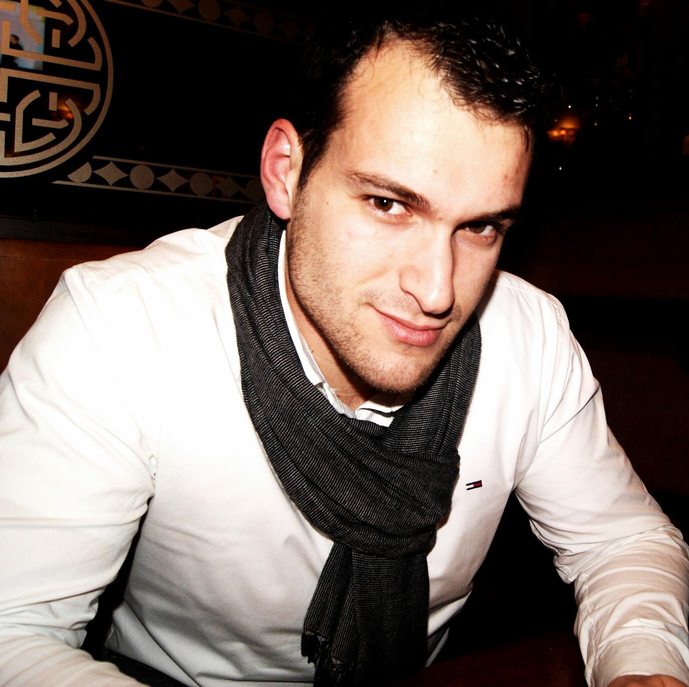

  I've been developing web applications as a Full Stack Developer since 2006, and from 2014 as Head of Research and Development at OpenHost. I've being using different technologies over the time, rangin from Ruby, to PHP, Node.js and roughtly with Golang on Microservices in the server, and AngularJS in the browser. Later years I've being proudly creating different tools focused in high performance and heavy loaded systems that help journalists to maintain online newspapers.

  I'm a huge believer on the SCRUM, and Agile methodologies for Project Management, but more importantly I'm a huge believer of problem solving and task focused workflows.

  While developing I try to use cuting edge technologies (Node.js, golang) and methodologies like KISS, DRY and using enterprise design patterns.

  I love Open Source Software so, as side projects I collaborate to improve it every day as Member at GNOME Foundation and Galician translators coordinator at GNOME Foundation. Since late 2009 I am an official member of Ubuntu (Ubuntu member) and since early 2010 I'm a proud member of GNOME Foundation.

  In the past I've created a custom Linux-based desktop focused in University Studies, with which we won the Libre Software contest here in Galiza. This project was oriented to create an specialized GNU / Linux environment, by simplifying administrative tasks and also doing massive migrations to open source software in educational settings.

Hi! I'm <strong>Fran Diéguez</strong> and I've been developing web applications 2005, the last two as a <strong>Project Manager and CTO at OpenHost</strong>, where he spends his days and nights on improving a powerful tool for online publishing, <a href="http://www.opennemas.com/">OpenNemas</a>.  For achieving this hard task he and his team are developing their own framework, Onm, focused in high performance and heavy loaded online newspapers.

For a long time his main focus was web performance <a href="https://github.com/frandieguez">engineering</a> and open source technology.

Prior to focusing on online newspapers, Fran worked as a open-source software developer at the University of Santiago de Compostela, where he have <strong>developed a custom Linux-based desktop</strong> for simplifying administrative tasks and also doing massive migrations to open source sofware in educational settings. This project <a href="http://www.mancomun.org/es/no_cache/actualidade/detalledenova/nova/a-osl-da-usc-gana-o-premio-eganet-2009-na-categoria-software-libre/">won the Libre Software contest</a> in Galicia, Spain.

Whenever not thinking web development, or newspapers, Fran can be found contributing to <a href="https://www.ohloh.net/accounts/frandieguez">open-source projects</a> like <strong>GNOME </strong>(as a project member) or Ubuntu as Galician translators coordinator, <a href="https://www.amazon.com/gp/pdp/profile/A362F32UBZHEUR">reading</a> or doing sports.

Currently is <strong>not available for hire</strong> but you can write him to propose future and innovative projects.
