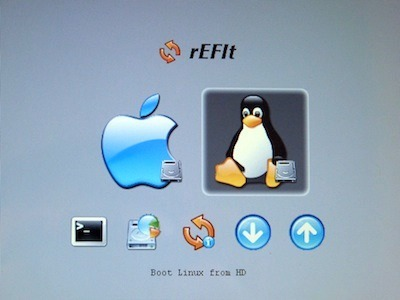

<div class="aligncenter">



</div>

OK, you messed it up, you’ve installed [Ubuntu](http://www.ubuntu.com/) [on your Mac](https://wiki.ubuntu.com/MactelSupportTeam/CommunityHelpPages) running a dual boot with OSX, and accidentally installed the bootloader to the MBR.  Well this will render your system useless as Mac’s use EFI and GPTs, rendering MBRs rather useless, outside of its MBR emulation mode that is. The proper location for installing the GRUB locader in this EFI-based systems has to be on your first Ubuntu partition, not in the whole disk’s MBR segment. If you try to install GRUB again in the proper location, that’ll will leave another icon of Tux just sitting there in your [rEFIt](http://refit.sourceforge.net/) menu.  Its a little annoying in my opinion so lets get rid of it. Within OSX, open your Terminal. If your Mac has only 1 hard drive then its pretty simple.  Just type in:

```bash
sudo fdisk -u /dev/disk0
```

and just type in your password and go.  This will write a new MBR to the proper segment and remove the extra logo from rEFIt. **Note:** Be careful in performing this action, because it does mess with your MBR. I don’t think your Mac is going to be that picky with the MBR since it uses a GPT by default but it still could **render your system unbootable**. As such I obviously take no responsibility for your actions. You break it, its your fault, not mine.
