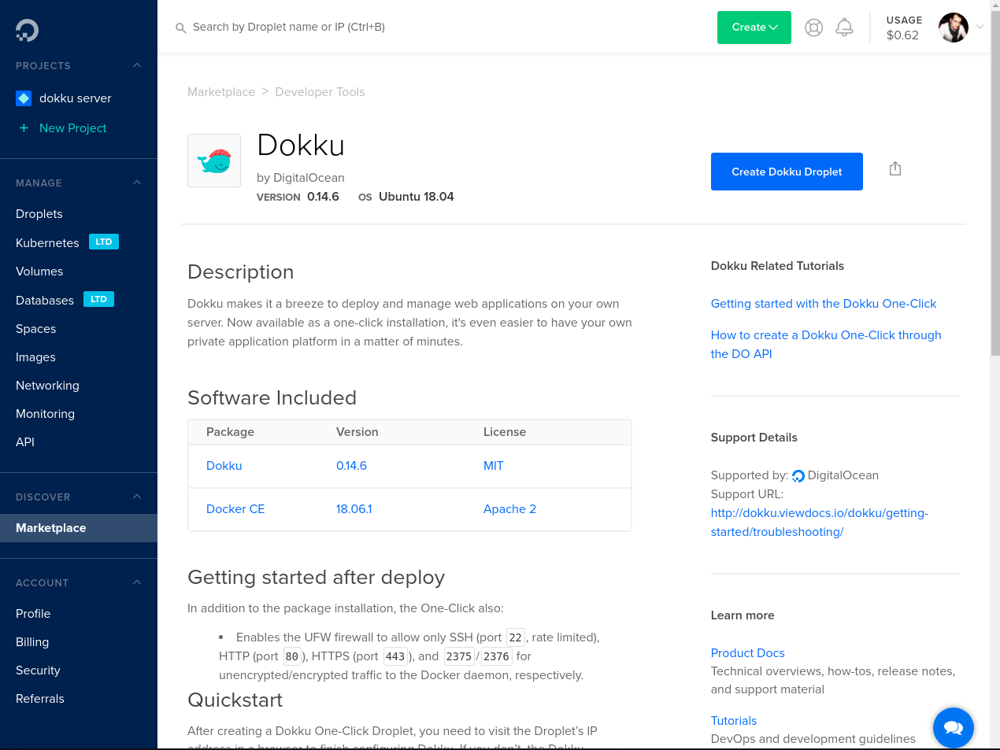
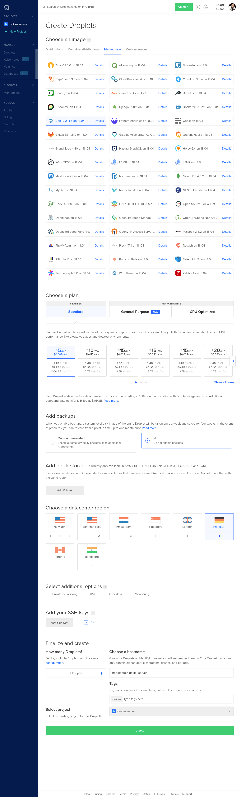
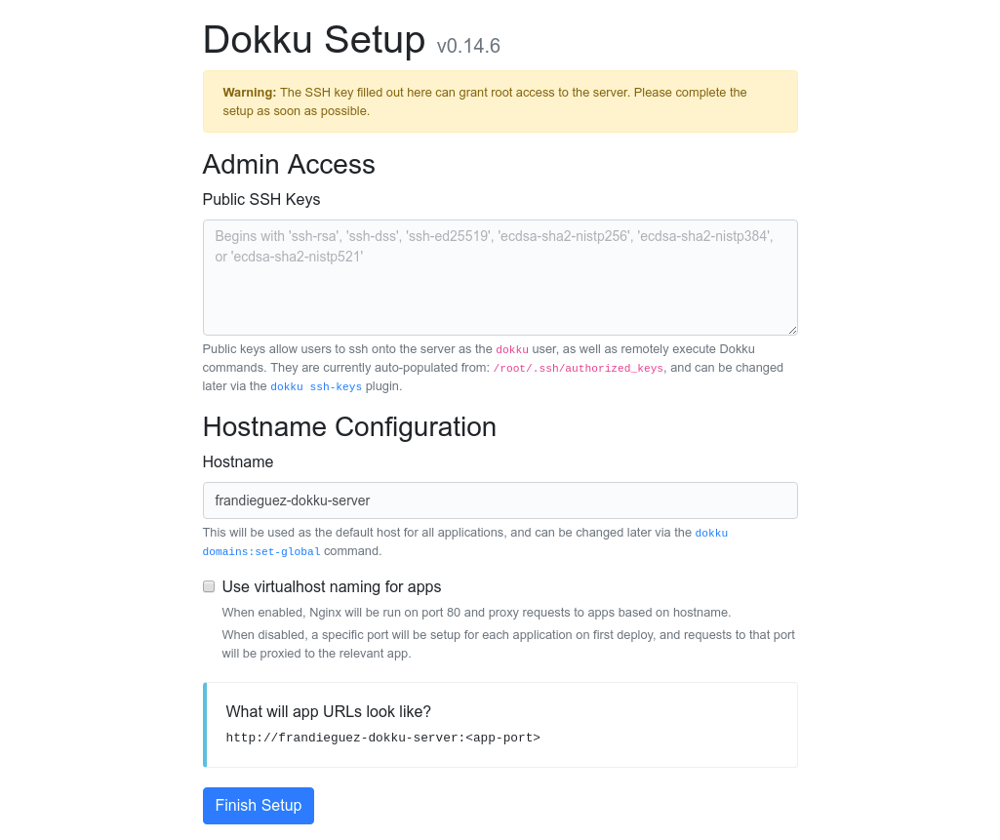

If you have been playing for some time with [heroku](https://www.heroku.com) or even [now.sh](https://zeit.co/now) you will be on my boat about how easy is to deploy applications on those services. **What if I tell you that you can have your own PaaS using [dokku](https://github.com/dokku/dokku) ? 😍** In this post I will explain how to deploy a node.js application within a docker container on your own Dokku service using a cheap Digital Ocean droplet.

<div class="aligncenter">


</div>

# 🚀 Deploying a DO droplet with Dokku
Due to addition of the [Marketplace](https://blog.digitalocean.com/introducing-digitalocean-marketplace/) to Digital Ocean you can easily deploy prebuilt droplets from your DO dashboard. So let's search for dokku and create a droplet with their 1-click install.



After clicking the install button you have to configure your droplet size and region. Do not enable IPv6 for now as seems that dokku has some problems with it.



Then you have to copy the IP address of your droplet. And open a new browser tab with it. you will see an administration form that will let you configure the Admin SSH key and the base domain name.

One feature that mimics heroku or even netlify is *Use virtualhost naming for apps*, this option will allow you to run one application per subdomain. If you do not enable this option each application will be exposed on the base domain but on different HTTP ports.



Click _Finish setup_, and after that you will have your dokku server up and running.

```bash
yay -S dokku
```

# Deploying your app

Ok, you have reached the point that you have your own heroku like server. So lets ramp up the server and deploy our custom app on it.

In order to do that we have to connect via SSH to the serer and create the app using the dokku command:

```bash
$ ssh root@159.89.100.242
Last login: Mon Apr 15 17:58:36 2019 from 83.165.229.217
root@frandieguez-dokku-server:~# dokku apps:create nodejs-app-sample
-----> Creating nodejs-app-sample... done
```

## Connecting services

For this app we do not need any other service, like a database or a queue server, but dokku provides an easy way to do this via plugins. You can review dokku plugins at the next link : [Dokku plugins](http://dokku.viewdocs.io/dokku/community/plugins/#official-plugins-beta). Think of them as docker-compose services that you have to link to your app. So the steps to add a MySQL server, i.e.:

- Install the plugin
```
sudo dokku plugin:install https://github.com/dokku/dokku-mysql.git
```
- Create the mysql service with  the name nodejsdatabase
```bash
dokku mysql:create nodejsdatabase
```
- Finally link the service to our app
```bash
dokku mysql:link nodejsdatabase nodejs-app-sample
```

## Deploying the app
Then in your development machine download the app code

```bash
$ git clone https://github.com/heroku/node-js-sample
Cloning into 'node-js-sample'...
remote: Enumerating objects: 410, done.
remote: Total 410 (delta 0), reused 0 (delta 0), pack-reused 410
Receiving objects: 100% (410/410), 215.25 KiB | 841.00 KiB/s, done.
Resolving deltas: 100% (63/63), done.
```

Then configure the dokku server to push changes to it
```bash
$ git remote add dokku dokku@159.89.100.242:nodejs-app-sample
```

Finally upload the changes to the dokku server
```bash
$ git push dokku master
Enumerating objects: 410, done.
Counting objects: 100% (410/410), done.
Delta compression using up to 16 threads
Compressing objects: 100% (317/317), done.
Writing objects: 100% (410/410), 215.25 KiB | 19.57 MiB/s, done.
Total 410 (delta 63), reused 410 (delta 63)
remote: Resolving deltas: 100% (63/63), done.
-----> Cleaning up...
-----> Building nodejs-app-sample from herokuish...
-----> Setting config vars
       CURL_CONNECT_TIMEOUT:  90
-----> Setting config vars
       CURL_TIMEOUT:  600
-----> Adding BUILD_ENV to build environment...
-----> Node.js app detected

-----> Creating runtime environment

       NPM_CONFIG_LOGLEVEL=error
       NODE_VERBOSE=false
       NODE_ENV=production
       NODE_MODULES_CACHE=true

-----> Installing binaries
       engines.node (package.json):  4.0.0
       engines.npm (package.json):   unspecified (use default)

       Resolving node version 4.0.0...
       Downloading and installing node 4.0.0...
       Using default npm version: 2.14.2

-----> Building dependencies
       Installing node modules (package.json)
       express@4.16.4 node_modules/express
       ├── escape-html@1.0.3
       ├── array-flatten@1.1.1
       ├── setprototypeof@1.1.0
       ├── utils-merge@1.0.1
       ├── cookie-signature@1.0.6
       ├── merge-descriptors@1.0.1
       ├── methods@1.1.2
       ├── path-to-regexp@0.1.7
       ├── range-parser@1.2.0
       ├── encodeurl@1.0.2
       ├── vary@1.1.2
       ├── fresh@0.5.2
       ├── parseurl@1.3.2
       ├── content-type@1.0.4
       ├── etag@1.8.1
       ├── statuses@1.4.0
       ├── cookie@0.3.1
       ├── content-disposition@0.5.2
       ├── serve-static@1.13.2
       ├── safe-buffer@5.1.2
       ├── depd@1.1.2
       ├── on-finished@2.3.0 (ee-first@1.1.1)
       ├── finalhandler@1.1.1 (unpipe@1.0.0)
       ├── qs@6.5.2
       ├── proxy-addr@2.0.4 (forwarded@0.1.2, ipaddr.js@1.8.0)
       ├── debug@2.6.9 (ms@2.0.0)
       ├── send@0.16.2 (destroy@1.0.4, ms@2.0.0, mime@1.4.1, http-errors@1.6.3)
       ├── type-is@1.6.16 (media-typer@0.3.0, mime-types@2.1.22)
       ├── accepts@1.3.5 (negotiator@0.6.1, mime-types@2.1.22)
       └── body-parser@1.18.3 (bytes@3.0.0, raw-body@2.3.3, http-errors@1.6.3, iconv-lite@0.4.23)

-----> Caching build
       - node_modules

-----> Pruning devDependencies

-----> Build succeeded!
-----> Discovering process types
       Procfile declares types -> web
-----> Releasing nodejs-app-sample (dokku/nodejs-app-sample:latest)...
-----> Deploying nodejs-app-sample (dokku/nodejs-app-sample:latest)...
-----> App Procfile file found (/home/dokku/nodejs-app-sample/DOKKU_PROCFILE)
-----> DOKKU_SCALE file not found in app image. Generating one based on Procfile...
-----> New DOKKU_SCALE file generated
=====> web=1
-----> Attempting pre-flight checks
       For more efficient zero downtime deployments, create a file CHECKS.
       See http://dokku.viewdocs.io/dokku/deployment/zero-downtime-deploys/ for examples
       CHECKS file not found in container: Running simple container check...
-----> Waiting for 10 seconds ...
-----> Default container check successful!
-----> Running post-deploy
-----> Creating new /home/dokku/nodejs-app-sample/VHOST...
-----> Setting config vars
       DOKKU_PROXY_PORT:  80
-----> Setting config vars
       DOKKU_PROXY_PORT_MAP:  http:80:5000
-----> Configuring nodejs-app-sample.frandieguez-dokku-server...(using built-in template)
-----> Creating http nginx.conf
-----> Running nginx-pre-reload
       Reloading nginx
-----> Setting config vars
       DOKKU_APP_RESTORE:  1
=====> Renaming container (938f82f6b6ab) vigorous_shockley to nodejs-app-sample.web.1
=====> Application deployed:
       http://nodejs-app-sample.frandieguez-dokku-server

To 159.89.100.242:nodejs-app-sample
 * [new branch]      master -> master
```

As you can see from the command output above while pushing changes to the dokku server it will:

 - Detect the type of the software, nodejs in this case
 - Configure the build environment
 - Cache build dependencies
 - Build the app
 - Launch the app on one HTTP port
 - Finally configure the nginx reverse proxy to enable a virtualhost and point it to the new deployed app.

## Accessing your deployed app

At this point your app is ready to be accessed

Edit your /etc/hosts adding the next line:

```bash
159.89.100.242 nodejs-app-sample.frandieguez-dokku-server
```

And go to [http://nodejs-app-sample.frandieguez-dokku-server](http://nodejs-app-sample.frandieguez-dokku-server). And your app is up and running.

Quite impressive! Your own heroku!

<div class="aligncenter">


</div>
