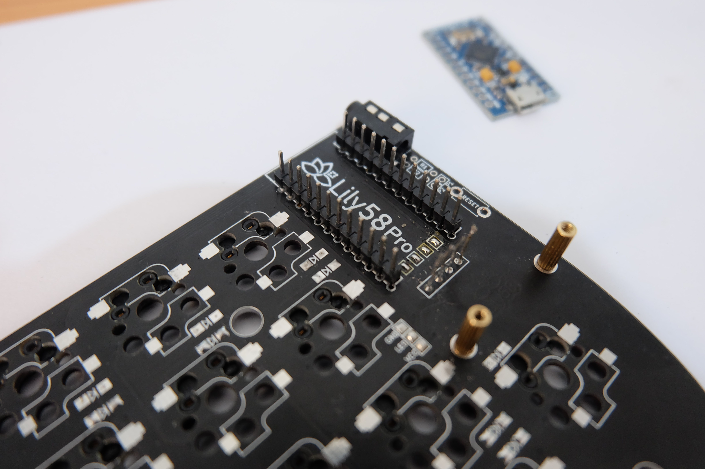

In this article, I'll explain some of the steps and tips that will help you while building my own split keyboard with Lily58 Pro.

The interesting part will come in later post that I'll write in which I will show some of the problems that I've faced and solutions that I've applied.

## Context

Let's put the context first.

__First__, I spend long hours in front of my computer and
over the years I've learned to shift from keyboard+mouse interaction to almost
keyboard-only usage. This is the strong root of the passion I've cultivated for mechanical keyboards, as writing on them is not comparable to anything else.

__Second__, I own more mechanical keyboards (keeb) than my pocket desires.
I've been using some keeb or another for more than 8 years, and I continuously
switch between them as I prefer each day. Keep in mind that this hobby is not cheap 💸.

__Third__, out there there are prebuilt keyboards or parts to build your own. Prebuild keyboards are quite good but the advantage of building your own is that you choose not only the layout of them, but the form factor, the tactile responsiveness, and the behavior as the chip that rules them is open source and easily hackable.

__Finally__, in the last year or so I've been suffering from wrist pain 🖖, mix that with a little voice in my head moving me to try a split keyboard or even an ergonomic one and you will
get the explosive combo.

These points put together the "necessity" of building not only an additional
keyboard for myself but one that could alleviate my wrist while, my DIY spirit
and experimentation desire with orthogonal, split keyboards which are the strangest girl in the party.

## Building it

A keyboard is formed by a **matrix of switches wired to main chip** which converts those row/columns activations into keystroke events (KEY_A, KEY_F2,...) and sends them to the computer.

But in a split keyboard, each half has its own chip that controls it. The "main" half acts as a master that forwards events produced from its sibling to the computer. This behavior can be switched programmatically without any problem.

The communication between both halves is done via TRRS interface, which is an audio-like audio cable but with 4 channels instead of 2, connected through JACK ports installed on each half.

### My parts selection

In [this world](https://www.reddit.com/r/ErgoMechKeyboards/), there are [tons of options](https://www.youtube.com/watch?v=SkNGxM4LRKQ) 
but the supply chain is scarce. If you plan to build one you can fall
into a rabbit hole while choosing parts, you only have to visit the [Mechanical Keyboard subreddit](https://www.reddit.com/r/MechanicalKeyboards/) to realize that. Luckily if you are interested in a custom keyboard but you're a little afraid of doing it there is a [second-hand market in Reddit](https://www.reddit.com/r/mechmarket/) that has a lot of options on fully built keebs.

Given the context I've presented in the previous section, I chose some parts that fit the most 
my requirements: build on top of **open-source hardware and software** so I could modify it;
move to **ortholinear split** keyboard layout; size around **60% and use MX-like** tactile switches.

| Part            | Link + notes                                                                                                                                                                                                                       |
| --------------- | ---------------------------------------------------------------------------------------------------------------------------------------------------------------------------------------------------------------------------------- |
| PCB             | [Lily58 Pro - MX socket pack](https://keyhive.xyz/shop/lily58)       This includes PCBs, Plates, Sockets, TRRS jacks, screws and standoffs                                                                                     |
| Keycaps         | [DROP + MATT3O MT3 SUSUWATARI](https://drop.com/buy/drop-matt3o-mt3-susuwatari-custom-keycap-set)   With the ergonomic variant                                                                                                  |
| Switches        | [DROP + INVYR HOLY PANDA MECHANICAL SWITCHES](https://drop.com/buy/drop-invyr-holy-panda-mechanical-switches)   Famous switches in the keep community similar to clear MX                                                       |
| Chips           | 2 x [Arduino Pro micros](https://www.sparkfun.com/products/12640)    The brain of the keyboard detects all keystrokes in the PCB matrix, interprets and sends them to the computer                                              |
| LCD             | 2 x [Arduino nano]()    The brain of the keyboard, detects all keystrokes in the PCB matrix, interprets and sends them to the computer                                                                                          |
| USB cable       | [Magnetic USB cable](https://www.amazon.es/conector-magn%C3%A9tico-NetDot-Generation-conectores/dp/B07RZ6F47G/?th=1)   Check the [problems post](/posts/problems-faced-while-building-my-lily58-split-keyboard//) for more info |
| TRRS cable      | [Braided TRRS cable](https://splitkb.com/products/braided-trrs-cable?_pos=1&_psq=braided%20cable&_ss=e&_v=1.0&variant=31226379501645)   Ok, this is just for flexing but looks so cool with it                                  |
| 3D printed legs | [3D printed legs from Thingiverse](https://www.thingiverse.com/thing:4493691) To tilt the keyboard a little bit                                                                                                                    |
| Switches lube   | [Krytox GPL 205 grade 0 lube](https://divinikey.com/products/krytox-gpl-205-grade-0-switch-lubricant)                                                                                                                              |

As you can see the list of components could be a little overwhelming if you are not in this world.
To summarize it, you have an electronic place that the rest of the components attach to. You have one little switch for each key and on top it, you put a keycap. All those switches are connected to an electric board and on that board you put the chip that controls everything.

### The building process
I'm not going to be fully specific on how to build it as the are fully detailed guides like https://imgur.com/gallery/eM0zWS9, but I'll explain it quickly. I think that where I can contribute the most is by sharing my failures, and that is covered in the next article.

All the process could be separated into 3 sections: 1) soldering electronic parts 2) Lubing the switches 3) putting all together

#### The soldering part

- First of all, you need to solder SMD diodes alongside each switch socket, on my Lily58 PCB
  there are 58 switches so a ton of work to do. As a little advice don't overheat your soldering iron, 150 C if enough.
- To continue you must connect the brain, the Arduino Pro Micro of your keyboard to the main PCB, **PLEASE do not solder it directly using pin headers**, just use [Millmax sockets](https://www.40percent.club/2018/03/sockets.html). This type of connector allows you to remove the chip from the board as it is hot-swappable. Using them make your life easier, as you will see in the "Problems faced" section down below.
- Sold the LCP panel on top of each Arduino using long 
- And to finish with the soldering part you must solder the JACK sockets and the RESET buttons to the PCB.

In the image above you can see the matrix on the PCB where diodes and switch sockets are already soldered.

I want to give my kudos to [the documentation from keeb.io](https://docs.keeb.io/iris-rev2-build-guide/#solder-diodes), they have incredible detailed documentation about how to solder, tools required, tips and tricks.

#### Lubing

One of the revealing parts for me was lubing. Usually, switches come prelubed, which basically consist on opening each switch and apply some special lubricant on [its insides, on the spring, and the stem](https://www.youtube.com/watch?v=qSgPKPoFo2k). In mainstream switches the quality of this lube is not 
good, and in the community of DIY custom keyboards, you try to apply a higher 
quality lube.

In my case, I choose **Krytox GPL 205 grade 0**, the best I could buy online at the moment. As mentioned before keyboard parts are usually sold out as they are not manufactured in large chunks.

  

The sensation between from a non-lubed against a lubed switch is like day and night, you will feel a smoother activation point and quieter sounds, as this process eliminates all the roughness of the plastic material.

#### Putting all together

From this part on things will get easier:

- Connect all your keyswitches on every hotswap sockets using one of the plates and standoffs.
  create a "sandwich" with the PCB-Plate-Switches
- Put all keycaps on top of the keyswitches, which are the plastic covers.
- Put the backplate using the standoffs left and screw them together to finish everything!

You are done! 😍😍😍 and here is the final product 👇

### Programming it

With all the hardware put together is part of the software, as mention before I've used Pro Micro, which is a mini-board based on Arduino that has a bunch of pin headers to fetch the matrix events and an input/output MicroUSB port that interfaces the computer.

Pro Micro boards don't come with firmware preinstalled, but there is a community-driven project to make it to work called [QMK](https://qmk.fm/#/). **QMK** is a small program, aka firmware, that luckily is open source and with an [incredible documentation page](https://docs.qmk.fm/#/) that guides you on how to build it for a large number of custom keyboards, and it has support for split keyboards! 💖

As an advice, to build your firmware use a virtualized environment because QMK depends on a bunch of system libraries with specific versions that may not match your system. For doing that just follow the [QMK Vagrant page](https://beta.docs.qmk.fm/using-qmk/guides/development-environments/getting_started_vagrant)

I've built my very own [custom lily58 keymap](https://github.com/frandieguez/qmk_firmware/tree/master/keyboards/lily58/keymaps/frandieguez), forked from the main QMK GitHub repository. Some of the changes I've done on it are:

- Customize my keymap, lily58 pro supports 4 different keymaps reachable through the LOWER and RAISE physical buttons. Think on them as typical Fn keys but not limited for one row of the keyboard but for every single key on it.
- Change the behavior of the default half
- Add support for OLEDs
- Customize the information of the OLED panels

After building it on the Vagrant interface you must flash the firmware on both Pro Micro, one at a time. It's quite simple but scary the first time you do it.

Now you have completed the build process, congrats comrade! 🎉💃🥳

At this point, you must check if all key keys work properly by connecting the keyboard to the computer.

### Album and conclusions

I'm really proud of achieving this point. The process was long perhaps if you like DIY projects and love doing hacky things this will reward you.

The process involves a lot of research: you will learn a lot about electronics 📟, watch tons of ▶ Youtube videos about soldering SMD, read a large number of comments and experiences online. And if you find any problem there are incredible communities to look for information like Reddit ([r/MechanicalKeyboards](https://www.reddit.com/r/MechanicalKeyboards), [r/ErgoMechKeyboards](https://www.reddit.com/r/ErgoMechKeyboards/)) and geekhack.org forums.

But hey! **__Was this long process worth it?__** I could assure you that **Yes, not only that I learned a lot but my wrist pain has gone away!** Double combo 🎰

Below you can find some photos taken during the process of building it and the final product. Hope you like them!

  
  
  
  
  
  
  

## References

* Incredibly detailed guide: https://imgur.com/gallery/eM0zWS9
* "Official" build guide https://github.com/kata0510/Lily58/blob/master/Pro/Doc/buildguide_en.md
* One of my favorite professional keebs builder: https://www.youtube.com/watch?v=Qr3nYR15wxU
* Daniel Ting has a series of posts about this keyboard and the problems he faced https://dp12.github.io/posts/adventures-with-the-lily58-part-1/

