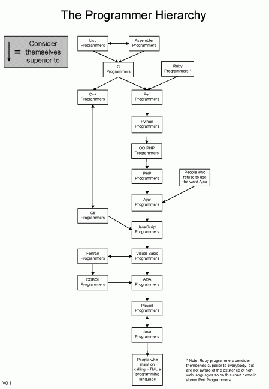

Buscando un poco por la red me he encontrado un tema muy curioso, y la verdad es que nunca me he parado a pensar. Como se consideran unos programadores a otros en función del lenguaje que utilizan. Unos chavales han echo un estudio sobre la jerarquía de programadores, o lo que es lo mismo lo que piensa uno que programa en Java de uno que programa en C, o los machotes que programan en Ensamblador.

Yo empecé programando en Visual Basic 6, creo que todos hemos empezado por ahí, es un lenguaje muy simple, el cual tiene una curva de apredinzaje bastante plana, luego me pasé a C. Tranquilos sobreviví al intento, este si que tiene una curva superexponencial.

Luego probé Java del que me quedé muy contento, y ultimamente estoy muy metido con el PHP, y por todo esto de la web 2.0 de Javascript utilizando algun framework.

Ahí es donde llegamos a donde quiero llegar, **frameworks**. ¿Realmente se es programador utilizando frameworks?, donde casi todo lo tienes a mano, con leer unos cuantos manuales ya estás preparado para hacer aplicaciones macro-productivas.

Ruby on Rails es uno de ellos: llegué, lo probé y no lo dejaré, sí yo también soy presa de ellos. Realmente es uno de los frameworks en programación web más fáciles de aprender, simplemente con utilizar la API ya tienes media vida arreglada. Pero, ¿ realmente eso es programar?
