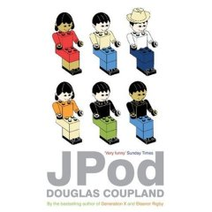

No es que tenga mucho tiempo con el nuevo trabajo, sobre todo ahora al
principio y con la inexperiencia pero los momentos de relax los pide el
cuerpo. Por lo que me he comprado el libro [JPod de Douglas
Coupland](http://www.amazon.co.uk/JPod-Douglas-Coupland/dp/0747585873/ref=pd_bbs_sr_1/026-4118863-0896457?ie=UTF8&s=books&qid=1183735287&sr=8-1 "Jpod de Douglas Coupland en Amazon.co.uk")
y como reza la sinopsis:

<blockquote>Ethan y sus 5 compañeiros de trabajo son islados en Jpod, en un limbo arquitectónico sin escape en las franjas de una gran empresa de diseño de juegos. Allí emprenden una batalla contra las demandas del endemoniado personal de comercialización que los torturan con cambios idiotas en juegos ya idiotas.</blockquote>
Promete mucho y la verdad es que por toda la red dicen que está genial, he elegido la versión en inglés porque además de aprender mucho vocabulario y practicar mi inglés técnico, siempre se disfruta mejor un libro en su "lingua mater" que en las penosas traducciones españolas.

Ya os contaré.
