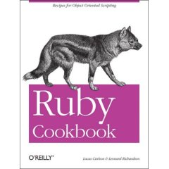

<div class="alignright">


</div>

Recientemente me han regalado este librejo, son 1000 páginas sin ningún desperdicio.

La valoración inicial, es un libro muy fácil de leer, además de una fuente inagotable de inspiración. Mediante ejemplos enseña todos los recovecos del lenguaje, digamos que son pequeños snippets que nos presentan el lenguaje Ruby como si un inglés nos estuviera hablando.

El libro toca todos los temas que todo programador de Ruby necesita, amenizándolo con pequeños trucos que de más de algún apuro sacarán. Sin duda un libro de los que se necesitan en el escritorio cuando se está en el tajo.

Para envidia y deleite de los PHPseros un pequeño lector de RSS en 8 lineas e incluso menos:

```ruby
require 'rss/2.0'
require "open-uri"
url = "http://www.oreillynet.com/pub/feed/1?format=rss2"
feed = RSS::Parser.parse(open(url).read,false)
puts "--- Canal1: #{feed.channel.title} ---"
feed.items.each do |item|
  puts item.title
  puts " (#{item.link})"
  puts item.description
end
```
