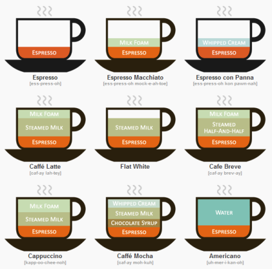

Con la taza siempre en la mano, Cafe-man, nunca me separo de este preciado líquido que tanto me relaja. En mi casa cuando estoy yo se hace una cafetera al día, eso sí grano molido en le momento y sin azucar, como los buenos cafeteros.
