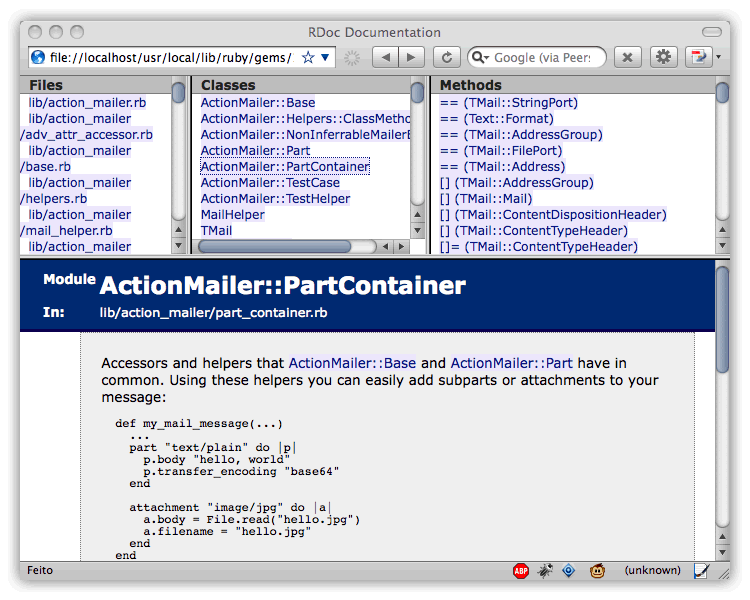

Durante una de mis sesiones de lectura de blogs me encontré que [en el de Sergio Gil](http://www.lacoctelera.com/porras/post/2008/07/11/rapido-acceso-la-documentacion-las-gemas-instaladas "Acceso rápido a la Documentación de tus gemas"), programador en [The Cocktail](http://www.the-cocktail.com/ "The Cocktail: consultora de experiencia de usuario y diseño de interacción"), había escrito como tener acceso directo a las gemas mediante un script de Bash que además autocompleta.

La verdad es que es muy cómodo, y no tienes que recurrir a el conocido \`gem server\`, el cual tiene que levantar un servidor webrick para acceder a toda la documentación. Con este hack no se consumen recursos adicionales y exprimir todavía más nuestro equipo para otras tareas.

El único problema que tiene el post de Sergio es que es dedicado a bash, y hace algún tiempo que proceso amor por [zsh](http://www.zsh.org/ "Z Shell"), por lo que he hecho la modificación para que rule en la misma. Simplemente copiad el siguiente código en vuestro \~/.zshrc y ya teneis el comnado gemdoc con autocompletado.

```
export GEMDIR=`gem env gemdir`
gemdoc() {
  open $GEMDIR/doc/`ls -FG $GEMDIR/doc | grep $1 | sort | tail -1`/rdoc/index.html
}
_gemdocomplete() {
  compctl -/ -W $GEMDIR/doc gemdoc
  return 0
}
_gemdocomplete
```

Por lo tanto solo habría que escribir en terminal ` gemdoc  ` y se
autocompletan los nombres de las gemas con sus respectivas versiones, si
no proporcionas la version se cogerá la última versión.


