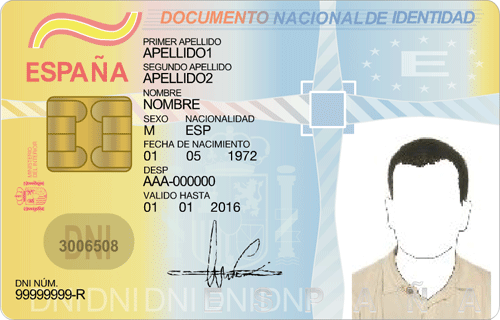

This howto will explain how to setting up pam-pkcs11 for use the DNI-e (Spanish personal ID) as your auth credential and login into Ubuntu with it.

I will assume that you have setted up your DNI-e. If you are looking for a comprehensive howto about this topic you can find it in the next link: <a href="http://www.ubuntu-guia.com/2010/08/dni-e-electronico-ubuntu-instalar.html">http://www.ubuntu-guia.com/2010/08/dni-e-electronico-ubuntu-instalar.html</a>

So here we go.

## Installing libpam-pkcs11 library
lipam-pkcs11 is a module and related tools for using X509-based smart cards with PAM (Pluggable Authentication Module). PAM is an extendable "daemon" that handles all the attempts of authentication in Linux-based systems.

```bash
sudo apt-get install libpam-pkcs11
```

## Getting information from inside the Spanish ID

So now you can use some of the available tools that comes with libpam-pkcs11 to inspect your DNIe. pkcs11_inspect is one of them. With this command you can inspect all the certificates available in your smart card while connected to your smart card reader.

```bash
$ pkcs11_listcerts
DEBUG:pam_config.c:203: Invalid CRL policy: no
DEBUG:pkcs11_listcerts.c:69: loading pkcs #11 module...
DEBUG:pkcs11_lib.c:975: PKCS #11 module = [/usr/lib/opensc-pkcs11.so]
DEBUG:pkcs11_lib.c:992: module permissions: uid = 0, gid = 0, mode = 755
DEBUG:pkcs11_lib.c:1001: loading module /usr/lib/opensc-pkcs11.so
[...]
DEBUG:pkcs11_lib.c:1047: - description: C3PO LTC31 (21070726) 00 00
DEBUG:pkcs11_lib.c:1048: - manufacturer: OpenSC (www.opensc-project.org) [...]
DEBUG:pkcs11_lib.c:1057:   - label: DNI electrónico (PIN1)
DEBUG:pkcs11_lib.c:1058:   - manufacturer: DGP-FNMT
[...]
DEBUG:pkcs11_lib.c:1612: Found 3 certificates in token
Found '3' certificate(s)
Certificate #1:
- Subject:   **/C=ES/serialNumber=MYIDNUMBER/SN=MYLASTNAME/GN=FRANCISCO/CN=MYLASTNAME, FRANCISCO (AUTENTICACI\xC3\x93N)**
- Issuer:    /C=ES/O=DIRECCION GENERAL DE LA POLICIA/OU=DNIE/CN=AC DNIE 003
- Algorithm: rsaEncryption
DEBUG:cert_vfy.c:407: Neither CA nor CRL check requested. CertVrfy() skipped
Certificate #2:
- Subject:   **/C=ES/serialNumber=MYIDNUMBER/SN=MYLASTNAME/GN=FRANCISCO/CN=MYLASTNAME, FRANCISCO (FIRMA)**
- Issuer:    /C=ES/O=DIRECCION GENERAL DE LA POLICIA/OU=DNIE/CN=AC DNIE 003
- Algorithm: rsaEncryption
DEBUG:cert_vfy.c:407: Neither CA nor CRL check requested. CertVrfy() skipped
Certificate #3:
- Subject:   **/C=ES/O=DIRECCION GENERAL DE LA POLICIA/OU=DNIE/CN=AC DNIE 003**
- Issuer:    /C=ES/O=DIRECCION GENERAL DE LA POLICIA/OU=DNIE/CN=AC RAIZ DNIE
- Algorithm: rsaEncryption
[...]
DEBUG:pkcs11_listcerts.c:160: Process completed
```

As you can see there are 3 certificates available inside my ID,
1.  one from Spanish police
2.  one in the line that contains " AUTENTICACIÓN" that means that is a certificate for authentication purposes
3.  and another one in the line that contains "FIRMA", that means that is a certificate for signing data

I will use the second one.

## Configuring libpam-pkcs11

There are some configuration files inside the libpam-pkcs11 debian package that will help us to get this module to work. So we need to create the configuration folder and copy two of those example files:

```
sudo mkdir -p /etc/pam_pkcs11/cacerts
cd /etc/pam_pkcs11/
sudo cp /usr/share/doc/libpam-pkcs11/examples/{pam_pkcs11.conf.example.gz,subject_mapping.example} /etc/pam_pkcs11/
```

After that, I have to make a hack to get all the process work. The usual procedure is place the certificate issuers  CRL's and CA's files ("Spanish police"' certificate files for DNIe) inside the /etc/pam_pkcs11/cacerts folder and execute

```
sudo pkcs11_make_hash_link
```

but  with this procedure the libpam-pkcs11 library WILL NOT WORK.

PKCS11 tries to validate my ID certificate against its issuer, the Spanish police. For whatever reason I can't get pkcs11 to read the certificate files available at <a href="http://www.dnielectronico.es/seccion_integradores/certs.html">http://www.dnielectronico.es/seccion_integradores/certs.html</a>.  So for now I will deactivate this check. Take notice that this could be **REALLY DANGEROUS** and I will investigate further to get this to work.

You must change the file /etc/pam_pkcs11/pam_pkcs11.conf and change the line:

```
cert_policy = ca,signature;
```

to

```
cert_policy = no;
```

## Mapping ID certificates to users
Reached this point you will be wondering how pkcs11 maps system users to DNIe unique cards. For this pam-pkcs11 has a built in extendable mappers, among them you can use a local file, an LDAP server, a Kerberos server, etc. For now I will explain how to setup the local file-based.

Local file-based mapper uses a local file located at /etc/pam_pkcs11/subject_mapping  with the next format:

```
DNIE-identifier -> localsystemuser
```

So we only have to replace these parameters with the real ones.

Lets assume that the local system user is "fran". Now for getting the DNIe-identifier parameter you can use the pkcs11_listcerts command:

```bash
$ pkcs11_listcerts |grep AUTEN
```

this will have the next output:

```bash
PIN for token:
- Subject:   /C=ES/serialNumber=myspanishidnumber/SN=mylastname/GN=myname/CN=mylastname, myname (AUTENTICACI\xC3\x93N)
```

So the DNIE-identifier is **"/C=ES/serialNumber=myspanishidnumber/SN=mylastname/GN=myname/CN=mylastname, myname (AUTENTICACI\xC3\x93N)"**
So you must add the next line to the /etc/pam_pkcs11/subject_mapping file:

```
/C=ES/serialNumber=myspanishidnumber/SN=mylastname/GN=myname/CN=mylastname, myname (AUTENTICACI\xC3\x93N) -> fran
```

## Tell PAM to make use of pkcs11 module

Last step! With pkcs11 already set up you have to configure PAM to make use of the pkcs11 module. For this you only have to add the next line to the /etc/pam.d/common-auth. Take notice that must be first non-comment line in the file as PAM uses the «first rule matched wins»

```
[...]
auth       sufficient   pam_pkcs11.so
# here are the per-package modules (the "Primary" block)
auth    [success=1 default=ignore]    pam_unix.so nullok_secure
[...]
```

Ok, all configured so from now you can login into your Ubuntu 12.04 system with your DNIe.

More information about libpam-pkcs11 configuration available at <a href="http://www.opensc-project.org/doc/pam_pkcs11/pam_pkcs11.html">http://www.opensc-project.org/doc/pam_pkcs11/pam_pkcs11.html</a>.

&nbsp;
