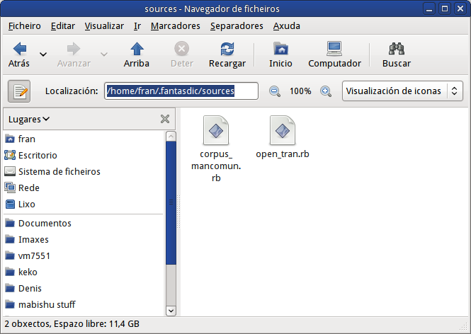
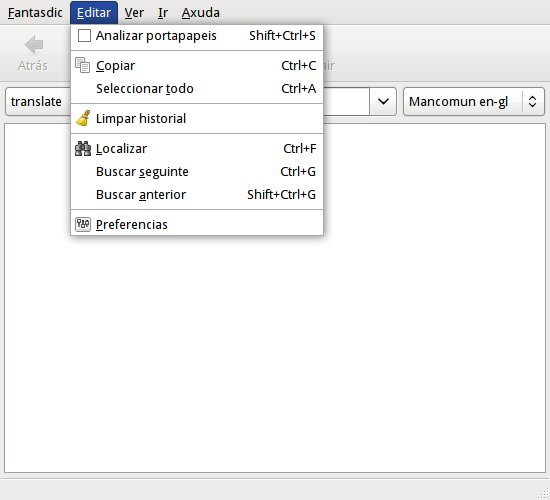
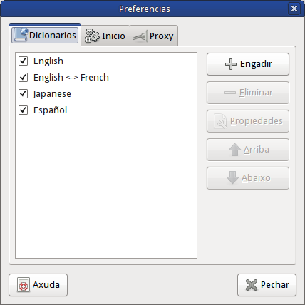
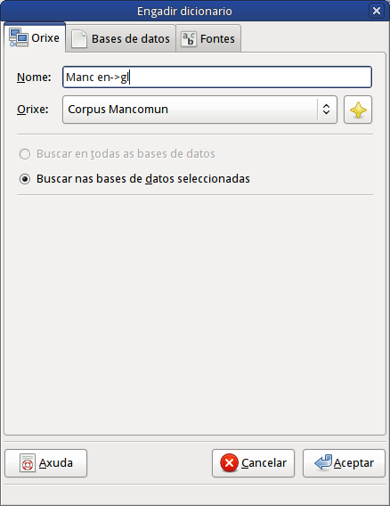
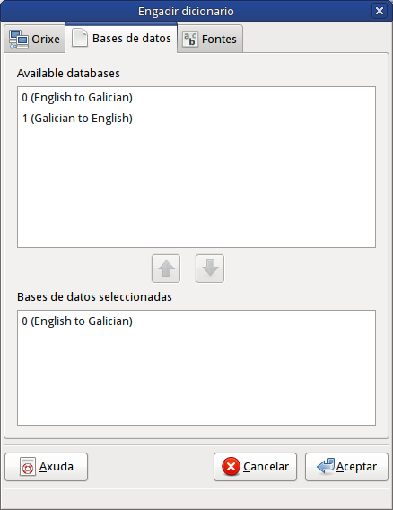
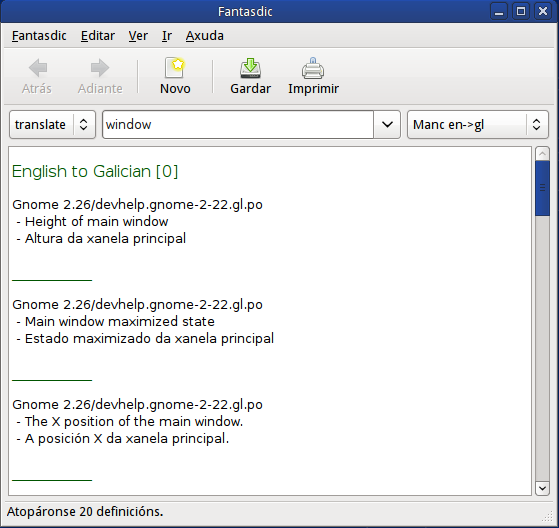

O aplicativo <a href="http://www.gnome.org/projects/fantasdic">Fantasdic</a> é un aplicativo de diccionario que permite buscar palabras dende moitas e diversas fontes. Destinado principalmente ao escritorio de GNOME, pero tamén pode traballar en outras plataformas, incluso en Windows. Fantasdic é software libre e programado na linguaxe de programación Ruby.

A principal vantaxa que presenta é o sistema de complementos, o que permite de forma sinxela extender o programa para que poida “consumir” datos dende as fontes que desexemos. O único necesario é programar o complemento axeitado.

Podedes obter a tradución ao galego dende: <a href="http://l10n.gnome.org/vertimus/fantasdic/master/po/gl">http://l10n.gnome.org/vertimus/fantasdic/master/po/gl</a>

Aquí explicarei como instalar os dous complementos que programei para estender o aplicativo e así permitir que poida consumir datos dende <a href="http://open-tran.eu">http://open-tran.eu</a> e máis do <a href="http://corpus.mancomun.org">Corpus de Mancomun</a> (<a href="www.mancomun.org">www.mancomun.org</a>).

## Instalación de plugins

Iniciar unha vez o fantasdic para que cree o cartafol de configuración do usuario e pechalo.
Copiar os seguintes ficheiros .rb no cartafol ~/.fantasdic/sources.

- [corpus_mancomun.rb](./corpus_mancomun.rb) – Complemento para consulta do corpus de corpus.mancomun.org
- [open_tran.rb](./open_tran.rb) – Complemento para consulta de Open-Tran.eu

Iniciar o Fantasdic.

## Configuración da orixe
Ir ao menú Editar->Preferencias.

Pulsar no botón Engadir no separador Dicionarios.

Abrese un diálogo para meter unha orixe. Seleccionamos en orixe o “Corpus Mancomun” e inserimos un nome para poder diferencialo do resto (p.ex. “Manc. en->gl”),

Vamos á lapela “Bases de datos”, e activamos a que queremos (seleccionamos unha e damoslle ao botón Baixar).

Xa esta!

## Consultas

Agora para facer consultas seleccionamos no despregábel da dereita a orixe que queiramos e inserimos o termo a buscar.

