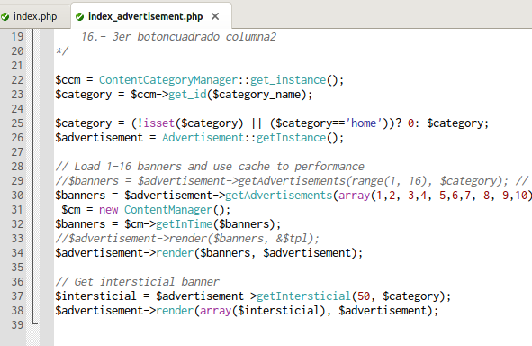

<div class="alignright">


</div>

When you develop a very important web app it is pretty sure you will
need debugging it. The best way to do this is using XDebug so in this
article I am going to explain how to setup and use XDebug with Komodo
IDE or Edit, but you can use it for Netbeans or Eclipse as well. The
first step is install XDebug in your system (I assume that you have
already installed a LAMP server in your system).
```
sudo aptitude install php5-xdebug
```
So now you should have the file xdebug.ini at /etc/php5/conf.d/. I have
done some improvements on it so you can [download my xdebug
file](http://www.mabishu.com/downloads/xdebug.ini.mabishu.com "XDebug configuration file with all the configurations available")
and replace yours. Content of the file is categorized and ready to work
out of the box but you have to change the line that loads the extension
library to fit your path extension.
```ini
zend_extension=/usr/lib/php5/20090626/xdebug.so
```
Restart your Apache server to reload the PHP configuration.
```
sudo service apache2 restart
```

Now you have to set up Komodo Edit or Komodo IDE to listen XDebug
connections. Start Komodo and go to **Edit -\> Preferences -\> Debugger
-\> Connection** and modify your configurations to fit the next
screenshot.
<div class="aligncenter">


</div>

So if you point your browser to your app,
append the "XDEBUG\_SESSION\_START=1" HTTP GET parameter or use one
Firefox (if you are using it) extension like [Easy
XDebug](https://addons.mozilla.org/es-ES/firefox/addon/58688/ "Easy XDebug Firefox extension download page")
and Komodo will pop up pointing to the start point of your app. Now you
can use keyboard shortcuts to step into, step over continue or stop your
debugging session. I hope this could help you, and if you have any
suggestion please contact me or write me a comment below.
