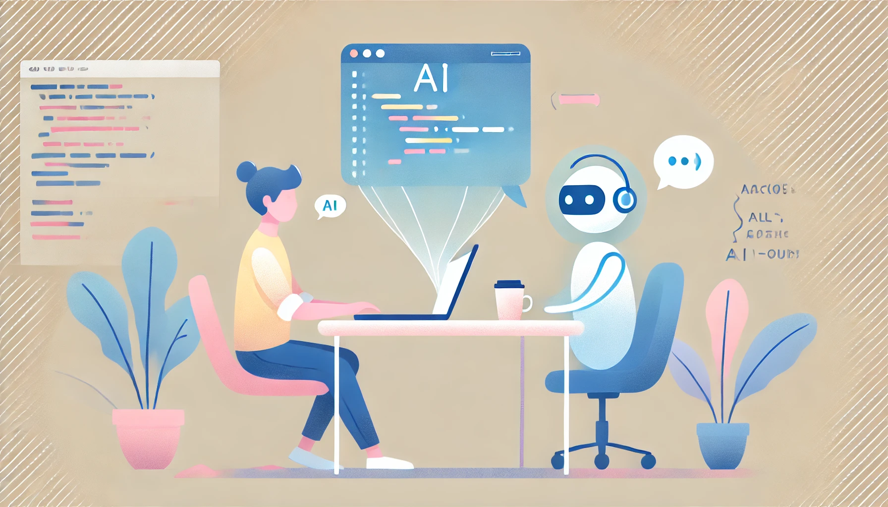

With the trend of models like ChatGPT and Codex, more and more developers are using AI to solve coding problems, improve their solutions, and even practice technical interviews. But this raises a basic question: are technical assesments affected by the use of AI?

## ✅ The Good Side

AI has brought clear advantages to technical interviews:

- **Interview preparation**: Allows developers to practice algorithm problems and receive detailed explanations.
- **Accelerated learning**: Suggests improvements in code, teaches best practices, and helps to distile and understand complex concepts.
- **Debugging assistance**: Instead of getting stuck on trivial errors for hours, developers can quickly ask for help and keep moving forward.

## ⚠️ Risks and Challenges

However, companies are also starting to notice some issues:

- **Excessive dependency**: Some candidates rely so much on AI that they struggle to solve problems without it.
- **Biased evaluation**: If a candidate uses OpenAI to complete a take-home test, aren't companies evaluating the future employee or GenAI skills?
- **False expectations**: As soon as the developers joins the company using those technologies, there is a high chance that he/she will not understand it completely, and when exposed to more complex problems/codes the developer might not know how to modify or explain it.

## How to Adapt to This New Reality?

Both developers and companies need to find a balance:

**For candidates**: Use AI to learn, but make sure to fully understand and explain every solution. Use it as a helping buddy.

**For companies**: Design technical tests where the focus is not just on the final answer but on the thought process behind it.

## 🔮 The Future of Technical Assessments

Traditional assessments may evolve, putting more emphasis on logical thinking, system design, and live debugging rather than simply solving coding problems.

OpenAI does not replace programming skills, but it does change the way we learn and demonstrate our abilities. Knowing how to use it wisely can be the difference between a great candidate and one who just copies answers. 🚀

⸻

What do you think? Should companies ban AI in technical tests or adapt to this new era? Let me know in the comments! 🔥