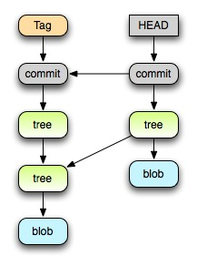

Continuo la serie de articulos sobre Git, echa un vistazo a la anterior
entrega donde hablamos de creción de [repositorios y una pequeña
introducción](http://www.mabishu.com/blog/2008/06/04/control-de-versiones-con-git-i "Control de versiones con Git (I) | Mabishu").
En esta ocasión indagaré un poco más en el ciclo de vida de nuestro
software donde mostraré como crear branches, tags y como Git gestiona
todo esto de manera increíble y es realmente lo que lo hace, bajo mi
punto de vista, el mejor SCM que he probado.

## Internalidades de Git

<div class="alignright">


</div>

Git internamente gestiona los distintos commits en forma de arbol, donde cada "hoja", que el llama blob son los distintos archivos en un instante determinado y los "nodos", que llama tree son los distintos directorios. Siguiendo este esquema la gestión del repositorio se simplifica mucho.

En el esquema anterior podemos ver como se pueden diferenciar 2 arboles de objetos y nodos distintos, el primero que referenciamos mediante un tag (con una rama descendente única y que contiene dos directorios y un archivo), y el segundo sería exactamente el mismo arbol anterior pero añadiendole un nuevo archivo. Además el segundo es la copia actual en nuestro directorio de trabajo.

## Creación de Tags

Entonces y deduciendo un poco la creación de tags en Git es inmediata, basta crear un "puntero" que nos apunte, valga la redundancia, a el commit deseado.

```shell
git-tag -a nombre-tag -m "Creación de Tag nombre-tag"
```

Si no proporcionas el parámetro -m, simplemente se abrirá tu editor $EDITOR y podrás proporcionar una descripción a el tag en cuestión. Se pueden hacer múltiples acciones sobre un tag, en el caso anterior se crea un tag sin firmar con GPG pero podemos hacerlo firmado (con el parametro -s) para la posterior identificación de su creador. Para llevar a cabo el firmado se usa el parámetro signingkey de nuestro
.gitconfig

```ini
[user]
    signingkey =
```

También podemos eliminar un tag con el parámetro -d, y demás.

[git-tag(1)](http://www.kernel.org/pub/software/scm/git/docs/git-tag.html "git-tag(1)")

Por lo tanto la creación de Tags como hemos visto es sencilla y directa,
y lo más importante sin crear copias innecesarias de archivos.

## Creación de Branches

Ahora imaginad el estado del arbol del repositorio de la imagen. En este caso hay dos commits de los cuales hemos omitido toda la estructura. El segundo commit es nuestra copia de trabajo actual y realmente podemos tratar como el branch "master". En este caso y para crear un nuevo branch lo que hacemos es crear un nuevo puntero (que no un commit nuevo) a el último commit, como muestro en el siguiente gráfico, a partir de ese momento los nuevos commits que hagamos se van a hacer sobre ese branch. Por lo tanto para crear un nuevo branch y hacerlo nuestra copia lo que haremos es ejecutar lo siguiente:

```shell
# creamos el branch a partir de master
$ git branch master <nuevo-branch>

# hacemos que ese branch sea nuestra copia en nuestro directorio de trabajo
$ git checkout <nuevo-branch>
```

En este gráfico por fin vemos que hemos creado un nuevo commit y se ha creado bajo nuestro branch y no sobre master. Si luego queremos retomar el branch master no tenemos más que hacer un checkout como en el ejemplo anterior y ya sería nuestra copia. En la próxima entrega hablaré de como podemos hacer de distintas formas merges de los branches, y de como Git de nuevo nos facilita la tarea.
