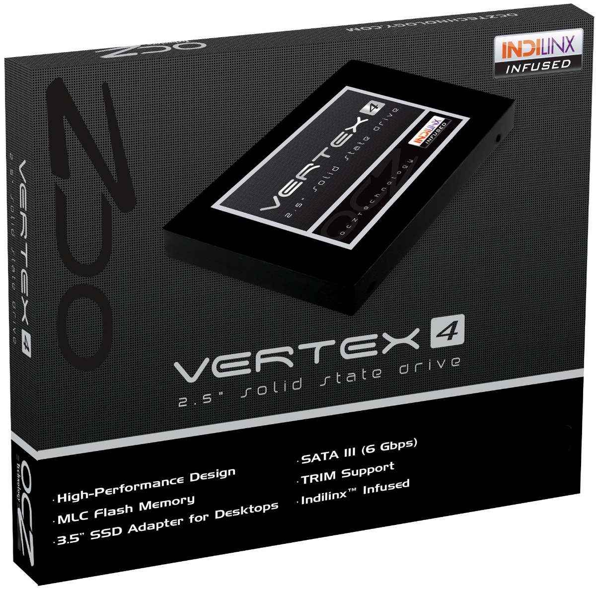

Recently I acquired an OCZ Vertex 4 SSD as my old hard drive was about to die as SMART were reporting. Definitely I would suggest you to go for a SSD as this upgrade will be the most significant and noticeable upgrade you can do for you computer. Moving on. In this article I will write down some tips/rules for get the best performance out of your Linux-based system while giving some explanations about them.

### Rule 1: Special flags for your mounts

By default, many distributions including Ubuntu use the 'relatime' flag for updating file metadata when file are accesed, but if you're unlikely to care about last access time you can skip this. Indeed this will come with both improve performance and, more importantly, the longevity of your SSD by reducing unnecessary writes. To make all these changes, open up a terminal and run:

```
sudo nano -w /etc/fstab
```

Then for all SSD devices in your system remove 'relatime' if present and add 'noatime' so it looks something like this:

```bash
/dev/sdaX   /   ext4   defaults,noatime,errors=remount-ro 0 1
/dev/sdaY   /home   ext4   defaults,noatime,errors=remount-ro 0 2
```

As you can see I didn't use the _nodiratime_ nor _discard_. In the first one the usage of noatime has nodiratime implicit. And in the second one I have experimented some performance drawbacks when performing operations with large number of small files.

### Rule 2: If it's temporary move it to RAM

Every day applications generat a lot of log files so to reduce unnecessary writes to the SSD move the temp directories into a ram disk using the 'tmpfs' filesystem, which dynamically expands and shrinks as needed. In your /etc/fstab, add the following:

```
tmpfs   /tmp       tmpfs   defaults,noatime,mode=1777   0  0
tmpfs   /var/spool tmpfs   defaults,noatime,mode=1777   0  0
tmpfs   /var/tmp   tmpfs   defaults,noatime,mode=1777   0  0
```

If you don't mind losing log files between boots, and unless you're running a server you can probably live without them, also add:

```
tmpfs   /var/log   tmpfs   defaults,noatime,mode=0755   0  0
```
### Rule 3: Perform TRIM cleanups periodically

Trim by "Batched Discard" is very simple. This can be manually with the following command in a terminal with root privileges or, for example, regularly via <a href="http://en.wikipedia.org/wiki/Cron">cron job</a> to perform.

```
$ sudo fstrim -v /
```

As the output obtained with the option `-v` output, how many bytes were trimmed:

```
/: 9937715200 bytes were trimmed
```

In this example, about 9.477 GB were trimmed. How often you need to perform this procedure, and how long each will take, depends very much on the personal use of the SSD or from its use, so that you can instead give any recommendation. If you want to let a Batched Discard regularly run automatically so that a straight editor with root privileges , the file **/etc/cron.weekly/batched_discard** (weekly) or /**etc/cron.daily/batched_discard** (daily) with the following content:

```
#!/bin/sh
LOG = /var/log/batched_discard.log
echo "\*\*\* $(date -R) \*\*\*" >> $LOG
fstrim -v / >> $LOG
fstrim -v /home >> $LOG
```

After that, the file is still feasible to be made:

```
sudo chmod 755 /etc/cron.weekly/batched_discard
```

The results of the cronjobs are timestamped in the log file **/ var / log / batched_discard.log.** To view use the command

```
tail /var/log/batched_discard.log
```

### Rule 4: If enough RAM, minimize SWAP usage

In my laptop I have 8 gigs of RAM so I have enough room for applications and caches. Given this situation we could avoid the SWAP usage by telling our system to only use it if absolutely necessary. Just issue the next command at your terminal:

```
echo "vm.swappiness=0" | sudo tee -a /etc/sysctl.conf
```

### Rule 5: Get rid of application with high I/O usage

Any applications that write excessively to a hard drive, like browsers, are also candidates for moving data. They can perform a lot of disk usage that will lead to reducing you SSD life so we can move this cache to RAM. To move the cache in Firefox, in the browser type 'about:config', right-click anywhere and select New --> String, and add 'browser.cache.disk.parent_directory'. Edit the variable and point it to a directory on a non-SSD drive or, if you don't mind losing the cache between boots and you're using the tweaks above, point it to /tmp for a super-fast memory cache. Moving the cache in Chrome is a little harder. You'll find the cache under ~/.cache/chromium. The unique solution I found is redirecting this folder to /tmp or the entire .cache directory, as many programs use this for caching data. Have a look at other applications you use and see if you can redirect any unnecessary writes as well.
