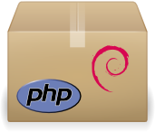

<div class="aligncenter">


</div>

Let me explain to all of you how to create a Debian package from a [PECL](http://pecl.php.net/ "PECL :: The PHP Extension Community Library") tarball. Currently is very simple to package a PECL extension without having any previous experience in Debian packaging and thus this system administration by installing deb packages could be more easy too.

So let's start the packaging.

For this example we will create a package that I have tested last weeks and seems to fit all my needs for handling YAML files in a great way [http://code.google.com/p/php-yaml/](http://code.google.com/p/php-yaml/).

Before review any packaging system instructions we have to set up our system. For one part you must install all the required dependencies (take a look at what dependencies has your PECL extension)

```
apt-get install dh-make-php php5-dev ubuntu-dev-tools build-essential
```

And for the other hand you must provide your data for the signature of Debian packages:

```bash
export DEBFULLNAME="Fran Dieguez"
export DEBEMAIL="fran.dieguez_AT_mabishu_DOT_com"
```

After that we will start the packaging instructions:

1.  Download the PECL package we want to create a package with:

```bash
$ pecl download yaml-beta
downloading yaml-1.0.1.tgz ...
Starting to download yaml-1.0.1.tgz (33,774 bytes)
.........done: 33,774 bytes
File /home/fran/Temp/php-developing/yaml-1.0.1.tgz downloaded
```

2.  So now we have to Debianize it with dh-make-pecl command and the appropriate arguments :

```
$ dh-make-pecl  yaml-1.0.1.tgz
Creating debian source package: php-yaml-1.0.1
Upstream is: Bryan Davis
Guessing Maintainer: Fran Dieguez <franDOTdieguez_AT_mabishu_DOTcom>
```

3.  Almost done! We have to make a little changes in the package. For example include in the control file all the dependencies (take a look at the README file inside the pecl extension source). In this package the "Build-Depends" field must include libyaml-dev, and the package "Depends" field must include libyaml-0-2:

```
$ cd php-yaml-1.0.1;
$ nano debian/control
```

    Change the file to match the next lines:

```
Build-Depends: debhelper (>= 7), po-debconf, xsltproc , php5-dev, libyaml-dev
[...]
Depends: ${shlibs:Depends}, ${php:Depends}, ${misc:Depends}, libyaml-0-2
```

4.  Finally compile it for getting the final deb file:

```
$ debuild
dpkg-buildpackage -rfakeroot -D -us -uc
dpkg-buildpackage: export CFLAGS from dpkg-buildflags (origin: vendor): -g -O2
dpkg-buildpackage: export CPPFLAGS from dpkg-buildflags (origin: vendor):
dpkg-buildpackage: export CXXFLAGS from dpkg-buildflags (origin: vendor): -g -O2
dpkg-buildpackage: export FFLAGS from dpkg-buildflags (origin: vendor): -g -O2
dpkg-buildpackage: export LDFLAGS from dpkg-buildflags (origin: vendor): -Wl,-Bsymbolic-functions
dpkg-buildpackage: source package php-yaml
dpkg-buildpackage: source version 1.0.1-1
dpkg-buildpackage: source changed by Fran Dieguez
  dpkg-source --before-build php-yaml-1.0.1
[...]
dh_builddeb
dpkg-deb: building package `php5-yaml' in `../php5-yaml_1.0.1-1_amd64.deb'.
dpkg-genchanges  >../php-yaml_1.0.1-1_amd64.changes
dpkg-genchanges: including full source code in upload
dpkg-source --after-build php-yaml-1.0.1
dpkg-buildpackage: full upload (original source is included)
```

5.  Test it! For installing the package you have to issue the next command:

```
$ sudo dpkg -i ../php5-yaml_1.0.1-1_amd64.deb
```
