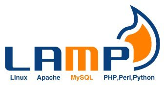

<div class="aligncenter">


</div>

One of the reasons cause I love the GNU/Linux for developing is its easy
and quick setup. So if you're a LAMP-dev you can setup a LAMP server
with less than 100 chars. With the next command you will have a
apache2+php5+mysql on Debian based systems with the bonus of phpmyadmin
for administer your databases.

```
sudo apt-get install phpmyadmin lamp-server^
```

Dont forget the trailing '^' char. Quick post, quick solution. Isn't it?
