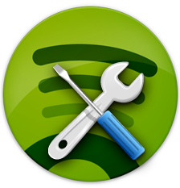

<div class="alignright">


</div>

After a lot of requests from Linux users, Spotify developers have integrated D-Bus support in version 0.4.8.282. So, what this means is simply and awesome! Now Linux developers could use this programmatic interface to interact with Spotify from other apps.

In other words, now is quite simple to send «play», «pause», «move next/previous song» events to Spotify and with this get Spotify fully integrate into our desktop.

I will explain how to introspect D-Bus interface and make some proof-concepts.

Take care that Spotify Linux client **now implements to MPRIS2 Dbus support** and almost the entire available libraries of D-Bus could interact with it.

So now we play around to "play" with D-Bus API of Spotify. But first of all we have to install one simple package (I'm using Ubuntu Maverick Merkat, take care of your linux distribution and version to find differences).

Now let's find what is the Spotify D-Bus's initial interface.
```
$ mdbus2|grep spotify
    com.spotify.qt
    org.mpris.MediaPlayer2.spotify
```

So, as you could see there are two interfaces to talk with, but looks
like the second one is our desired central point. Let's introspect it...

```
$ mdbus2 org.mpris.MediaPlayer2.spotify /org/mpris/MediaPlayer2
[METHOD]    org.mpris.MediaPlayer2.Raise() -> ()
[METHOD]    org.mpris.MediaPlayer2.Quit() -> ()
[PROPERTY]  org.mpris.MediaPlayer2.read( b:CanQuit )
[PROPERTY]  org.mpris.MediaPlayer2.read( b:CanRaise )
[PROPERTY]  org.mpris.MediaPlayer2.read( b:HasTrackList )
[PROPERTY]  org.mpris.MediaPlayer2.read( s:Identity )
[PROPERTY]  org.mpris.MediaPlayer2.read( s:DesktopEntry )
[PROPERTY]  org.mpris.MediaPlayer2.read( as:SupportedUriSchemes )
[PROPERTY]  org.mpris.MediaPlayer2.read( as:SupportedMimeTypes )
[METHOD]    org.mpris.MediaPlayer2.Player.Next() -> ()
[METHOD]    org.mpris.MediaPlayer2.Player.Previous() -> ()
[METHOD]    org.mpris.MediaPlayer2.Player.Pause() -> ()
[METHOD]    org.mpris.MediaPlayer2.Player.PlayPause() -> ()
[METHOD]    org.mpris.MediaPlayer2.Player.Stop() -> ()
[METHOD]    org.mpris.MediaPlayer2.Player.Play() -> ()
[METHOD]    org.mpris.MediaPlayer2.Player.Seek( x:Offset ) -> ()
[METHOD]    org.mpris.MediaPlayer2.Player.SetPosition( o:TrackId, x:Position ) -> ()
[METHOD]    org.mpris.MediaPlayer2.Player.OpenUri( s:none ) -> ()
[SIGNAL]    org.mpris.MediaPlayer2.Player.Seeked( x:Position )
[PROPERTY]  org.mpris.MediaPlayer2.Player.read( s:PlaybackStatus )
[PROPERTY]  org.mpris.MediaPlayer2.Player.readwrite( s:LoopStatus )
[PROPERTY]  org.mpris.MediaPlayer2.Player.readwrite( d:Rate )
[PROPERTY]  org.mpris.MediaPlayer2.Player.readwrite( b:Shuffle )
[PROPERTY]  org.mpris.MediaPlayer2.Player.read( a{sv}:Metadata )
[PROPERTY]  org.mpris.MediaPlayer2.Player.readwrite( d:Volume )
[PROPERTY]  org.mpris.MediaPlayer2.Player.read( x:Position )
[PROPERTY]  org.mpris.MediaPlayer2.Player.read( d:MinimumRate )
[PROPERTY]  org.mpris.MediaPlayer2.Player.read( d:MaximumRate )
[PROPERTY]  org.mpris.MediaPlayer2.Player.read( b:CanGoNext )
[PROPERTY]  org.mpris.MediaPlayer2.Player.read( b:CanGoPrevious )
[PROPERTY]  org.mpris.MediaPlayer2.Player.read( b:CanPlay )
[PROPERTY]  org.mpris.MediaPlayer2.Player.read( b:CanPause )
[PROPERTY]  org.mpris.MediaPlayer2.Player.read( b:CanSeek )
[PROPERTY]  org.mpris.MediaPlayer2.Player.read( b:CanControl )
[METHOD]    org.freedesktop.DBus.Properties.Get( s:interface_name, s:property_name ) -> ( v:value )
[METHOD]    org.freedesktop.DBus.Properties.Set( s:interface_name, s:property_name, v:value ) -> ()
[METHOD]    org.freedesktop.DBus.Properties.GetAll( s:interface_name ) -> ( a{sv}:values )
[METHOD]    org.freedesktop.DBus.Introspectable.Introspect() -> ( s:xml_data )
```
Interesting, isn't it? It have a large D-Bus API to send events to
Spotify. Among methods to control the playlist, one of my favourites is
get MetaData from the playing song. So now if you want to pause your
actual song of Spotify you can i
