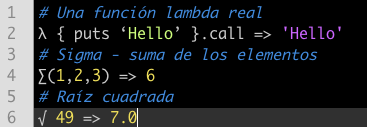
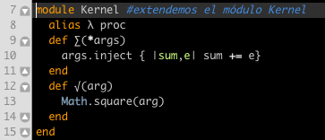

Es bien conocido que Ruby es uno de los lenguajes que más cercanos y que más satisfacción dan al programador. ¿Pero que pensarías si te enseñara esto?

Y es muy difícil de implementar? Sigue leyendo!

Mola un montón, no?

Solo tienes que recordar correr el programa con el flag KCODE -Ku, esto es, ruby -Ku nombre_programa,rb  :)
