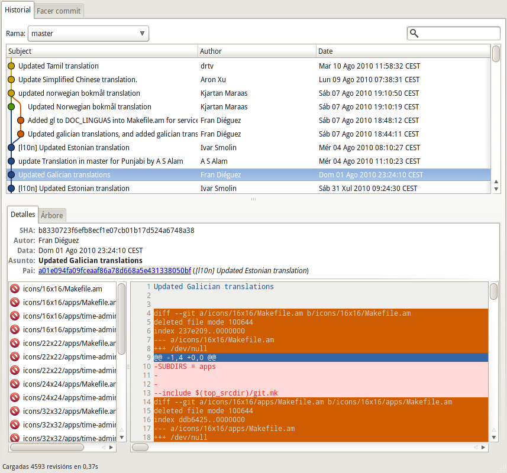

<div class="aligncenter md:w-2/3">


</div>

When I met git, I fall in love in the moment. You can read any
apointments I wrote previously
[here](http://www.mabishu.com/blog/2008/06/04/control-de-versiones-con-git-i/ "Control de versiones con GIT I"),
and
[here](http://www.mabishu.com/blog/2008/06/13/gestion-de-branches-y-tags-con-git-ii/ "Control de versiones con GIT II")
(in spanish) but today I'll explain how to restore files and directories
from previous commits that it was deleted by a mistake or intentionally
in the past. It’s quite easy
to [revert](http://gitready.com/intermediate/2009/03/16/rolling-back-changes-with-revert.html)
or [reset](http://gitready.com/beginner/2009/01/11/reverting-files.html)
a single file from history, but what about pulling an entire directory
out of the history? The solution is simple: `git checkout ID_of_commit
-- /path/to/dir` This will restore the directory from the given “commit
with ID” in the `/path/to/dir`. But, let me show you a mistake I made in
a commit into the gnome-system-tools repository: I send a translation
for a GNOME app in Galician and (I don't know how) accidentally, I
deleted the directory icons. For make this more complicated there were a
lot of commits ahead of my commit. In the previous image the highlighted
commit is where I deleted the directory. If you issue at you terminal
within the app directory:

```
    ➜  gnome-system-tools git:(master) git reflog
    cc9cead HEAD@{0}: commit: Restore deleted icons directory, deleted by a mistake.
    77f6382 HEAD@{1}: pull : Fast-forward
    a01e094 HEAD@{2}: a01e094fa09fceaaf86a78d668a5e431338050bf: updating HEAD
    b833072 HEAD@{3}: b8330723f6efb8ecf1e07cb01b17d524a6748a38: updating HEAD
    e6808e5 HEAD@{4}: pull : Fast-forward
    b833072 HEAD@{5}: b8330723f6efb8ecf1e07cb01b17d524a6748a38: updating HEAD
    e6808e5 HEAD@{6}: pull : Fast-forward
    fa069b2 HEAD@{7}: commit: Added gl to DOC_LINGUAS into Makefile.am for services and time documentation
    5cc13f5 HEAD@{8}: commit: Updated galician translations, and added galician translations for time and services documentation
    2915e6e HEAD@{9}: pull : Fast-forward
    b833072 HEAD@{10}: commit: Updated Galician translations  <------ this is the commit
    a01e094 HEAD@{11}: pull : Fast-forward
```

you'll see the ID that points to that commit. So applying the ^ modifier
to the damned ID I can obtain the previous commit ID, this one has the
icons directory and now is when the magic comes in:

```
➜  gnome-system-tools git:(master) git checkout b833072^ -- icons/
➜  gnome-system-tools git:(master) ✗ git status
# On branch master
# Changes to be committed:
#   (use "git reset HEAD ..." to unstage)
#
#   new file:   icons/16x16/Makefile.am
#   new file:   icons/16x16/apps/Makefile.am
#   new file:   icons/16x16/apps/time-admin.png
#   new file:   icons/16x16/apps/time-admin.svg
#   new file:   icons/22x22/Makefile.am
#   new file:   icons/22x22/apps/Makefile.am
#   new file:   icons/22x22/
```
